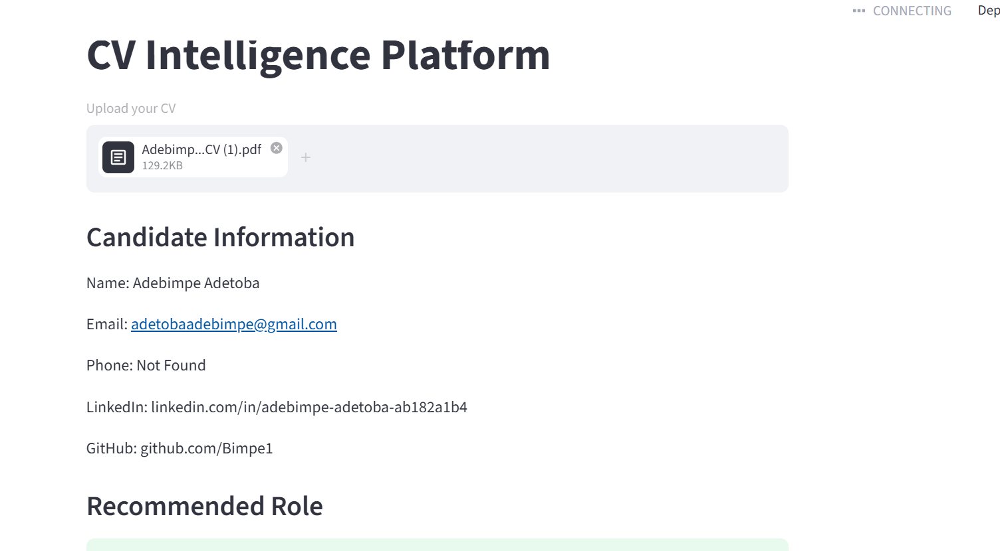
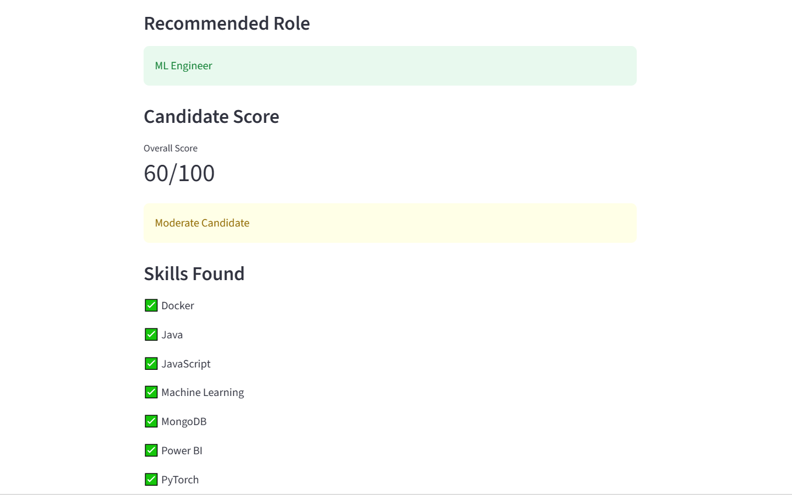
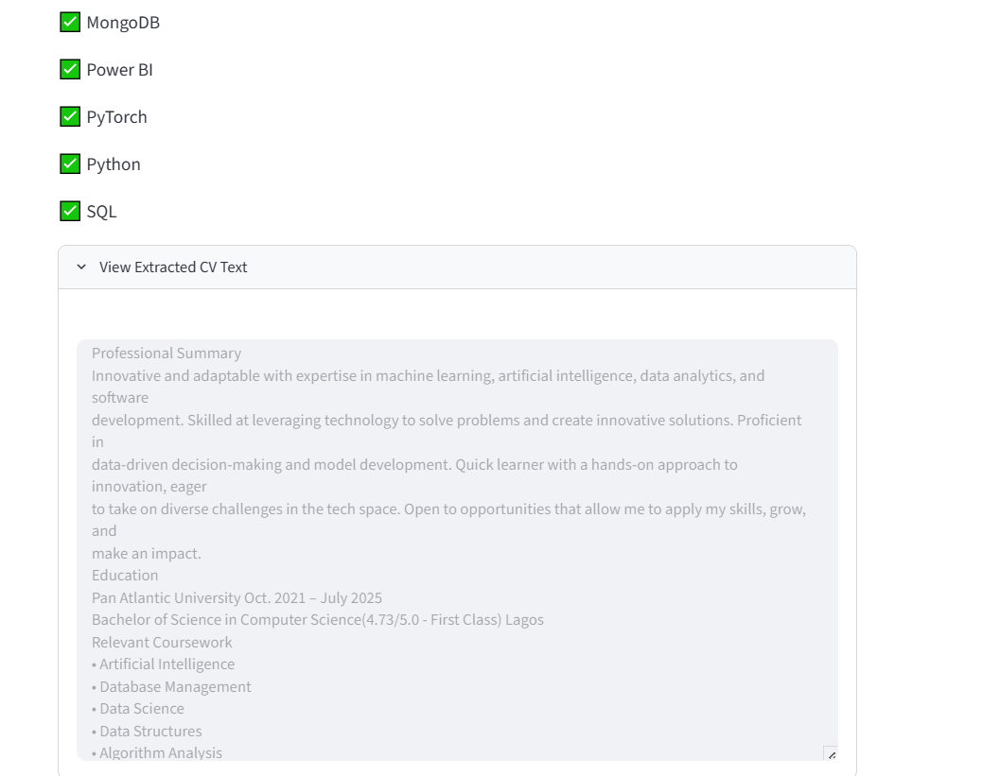

# CV Intelligence Platform

A machine learning-powered resume analysis platform that:

- Extracts text from PDF CVs
- Identifies candidate information
- Extracts technical skills
- Scores candidates
- Recommends suitable technology roles

Tech Stack:
- Python
- Streamlit
- Regex-based NLP
- PDF Processing

Future Enhancements:
- Semantic Job Matching
- Embedding-Based Skill Detection
- LLM-Powered Candidate Summaries
- Recruiter Dashboard

